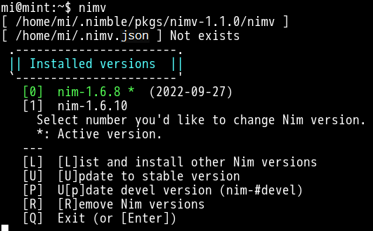
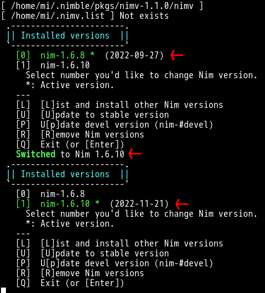
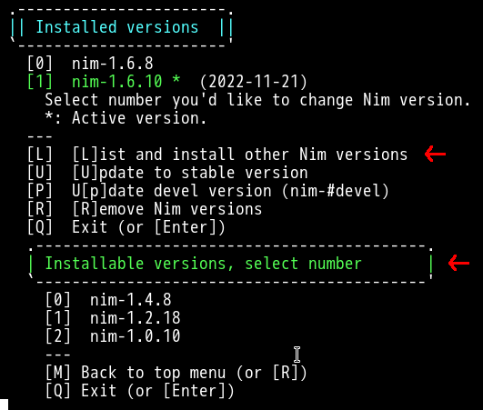
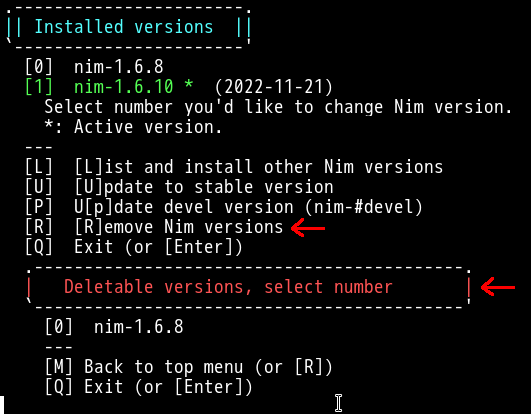
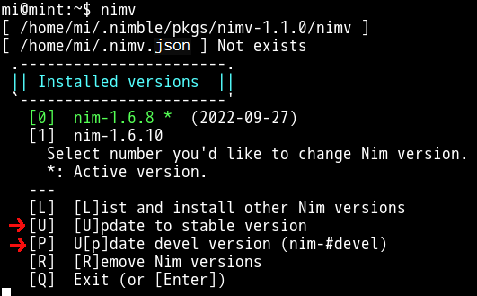
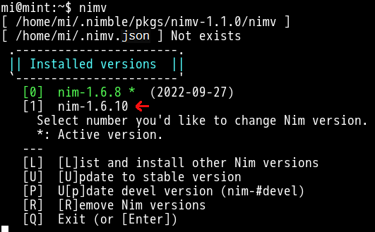
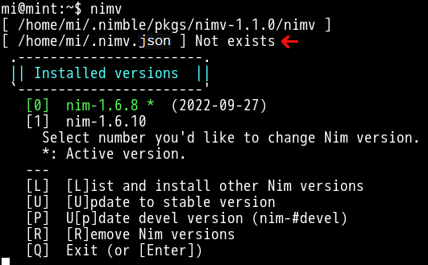
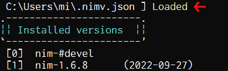
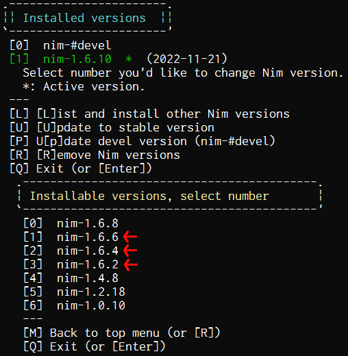

<!-- START doctoc generated TOC please keep comment here to allow auto update -->
<!-- DON'T EDIT THIS SECTION, INSTEAD RE-RUN doctoc TO UPDATE -->

- [Nimv : Simple CUI wrapper for Choosenim command](#nimv--simple-cui-wrapper-for-choosenim-command)
  - [Install](#install)

<!-- END doctoc generated TOC please keep comment here to allow auto update -->

# Nimv : Simple CUI wrapper for Choosenim command



## Install

---
<!---
1. Confirm nim version (at this time) [Nim language](https://nim-lang.org),

   ```bash
   $ nim --version
    Nim Compiler Version 1.6.10
    Compiled at 2022-11-21
    Copyright (c) 2006-2021 by Andreas Rumpf
   ```

   Required Nim version  
     - nim-0.19.6 or later minimum requested. **Not colorized**.
     - nim-1.4.0  or later recommended. **Colorized**.

1. Confirm execution path in `PATH variable`, if not exitsts it set, 
   - Windows10
      - `c:\Users\%USERNAME%\.nimble\bin`
   - Linux OS
       - `~/.nimble/bin`
--->

1. First install **choosenim** command  
   Refer to [https://github.com/dom96/choosenim](https://github.com/dom96/choosenim)
1. Confirm nim version

   ```bash
   $ choosenim stable
          Info: C:\Users\mi\.choosenim\downloads\dlls.zip already downloaded
     Extracting dlls.zip
          Info: Version 1.6.10 already selected
    ```

1. Install anyway other Nim version,

   ```bash
   choosenim 1.6.8
   ```

1. Install **Nimv** command,
   - Release version

      ```bash
      nimble install https://github.com/dinau/nimv@#v1.4.4
      ```

   - Bleeding edge version (may be same as release version)

      ```bash
      nimble install https://github.com/dinau/nimv@#head
      ```

1. Run **Nimv** command in MS-DOS/PowerShell Window or terminal window etc,

   ```bash
   nimv
   ```

## Key operation

### Top menu

---


### Selecting other Nim version

---

Press `'1'`(one) key to select **nim-1.6.10**.



Activated **nim-1.6.10**.

### Install other Nim versions

---

1. Press `'L'` key to list up installable nim versions.

   

1. You can **install other nim version** by pressing key `'0' or '1' or '2'`  
    at above situation.
1. You can then go back to top menu by pressing key `'M' or 'R'`.

### Remove nim versions

---

1. Press `'R'` key on top menu to remove nim version.

   

1. You can remove **nim-1.6.8** by pressing key `'0'`(zero).

### Other key operation

---

  
- Press `'U'` key to update to **stable** version.
- Press `'P'` key to install/update **devel** version (**nim-#devel**).

### Selecting a version on command line

---

1. Start Nimv and get the number `'1'` of **nim-1.6.10** then **exit** Nimv.
  
1. You can select **nim-1.6.10** by specifying the number `'1'` on command line as follows,

   ```bash
   nimv 1
   ```
1. You can specify from `0` up to max `9`.

### Transparently throwing commands to Choosenim

---

For instance on command line,

```bash
nimv 1.4.0
nimv versions
nimv show
nimv remove 1.6.8
snip
```

are same as

```bash
choosenim 1.4.0
choosenim versions
choosenim show
choosenim remove 1.6.8
snip
```

except `nimv --version`,

```bash
$ nimv --version
nimv 1.3.0 (2023/01): Simple CUI wrapper for Choosenim command.
              from 2021/10 by audin
Usage:
    nimv [option]
       option:
            None : Show simple CUI for Choosenim.
            -h, /?, /h, -v, --version: Show this page.
            -d: Start nimv with debug mode. Shown choosenim command.
    .nimv.json: List of old nim versions and configration to nimv.
                It can be set show/hide to list up the specified nim version.
                This file can be placed in user home folder.``
```

### Debug mode

---

Start with `-d` option.
It will show debug info while running.

```bash
nimv -d
```

## [Optional]:  Setup config file '.nimv.json'

### Place config file to your home folder

---

- Home folder generally is 
   - Windows OS:  `c:\Users\[UserName]\`
   - Linux OS:  `~/` or `/home/[UserName]` etc

1. Copy [.nimv.json](https://github.com/dinau/nimv/blob/main/.nimv.json) to your home folder
and restart Nimv.  
   
1. `.nimv.json` file correctly loaded.   
   

### Set choosenimDir and nimbleDir option

---

These options correspond to `--choosenimDir` and `--nimblemDir`.

You can set them in `.nimv.json` for instance,

- Windows OS

   ```json
   "choosenimDir":"c:\\foo\\mychDir",
   "nimbleDir":"c:\\bar\\mynbDir",
   snip
   ```

- Linux OS

   ```json
   "choosenimDir":"~/foo/mychDir",
   "nimbleDir":"~/bar/mynbDir",
   snip
   ```

### Addition of installble versions to menu 

---

Set value of `"1"` to `"enable:"` in `.nimv.json` for instance,

from

```json
snip
"oldVers":[
  {"enable":1, "ver":"1.6.10", "date":"2022-11-21", "comment":""},
  {"enable":1, "ver":"1.6.8", "date":"2022-09-27", "comment":""},
  {"enable":0, "ver":"1.6.6", "date":"2022-05-05", "comment":""},
  {"enable":0, "ver":"1.6.4", "date":"2022-02-09", "comment":""},
  {"enable":0, "ver":"1.6.2", "date":"2021-12-17", "comment":""},
snip
```

to

```json
snip
"oldVers":[
  {"enable":1, "ver":"1.6.10", "date":"2022-11-21", "comment":""},
  {"enable":1, "ver":"1.6.8", "date":"2022-09-27", "comment":""},
  {"enable":1, "ver":"1.6.6", "date":"2022-05-05", "comment":""},
  {"enable":1, "ver":"1.6.4", "date":"2022-02-09", "comment":""},
  {"enable":1, "ver":"1.6.2", "date":"2021-12-17", "comment":""},
snip
```

result in

   

You can enable up to **max 20** versions.

### Uninstall Nimv

---

```bash
nimble uninstall nimv
```

Bye.
